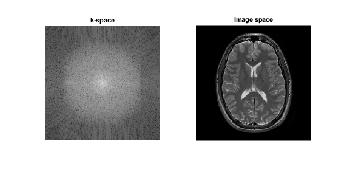
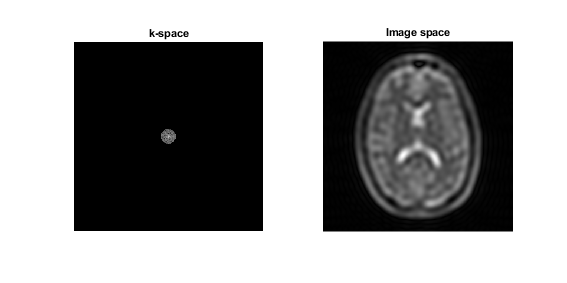
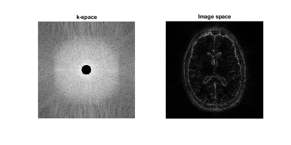
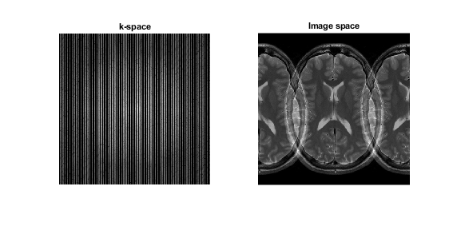
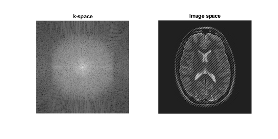
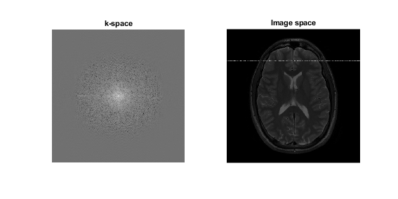
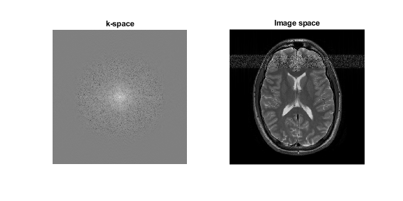
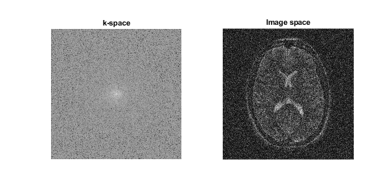
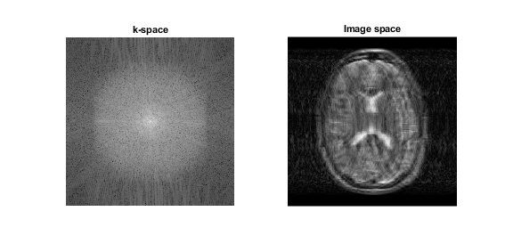
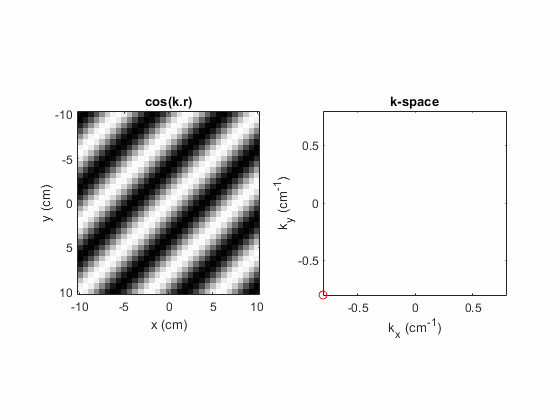

# MRI Reconstruction using the Fourier Transform

## Synopsis
A demonstration of magnetic resonance image (MRI) reconstruction using the Fourier transform, in 
[MATLAB](www.mathworks.com), with examples of some common image artefacts.

## Background
The nuclear magnetic resonance (NMR) signal can be spatially localised by applying a magnetic field gradient $\mathbf{G}$ across the object of interest:

$$
\mathbf{G} = \nabla \mathbf{B}_z = \left(\frac{\partial \mathbf{B}_z}{\partial x},\frac{\partial \mathbf{B}_z}{\partial y},\frac{\partial \mathbf{B}_z}{\partial z}\right)
$$

The application of $\mathbf{G}$ results in a linear variation in the static field $\mathbf{B}_0$ as a function of position $\mathbf{r}$:

$$
\mathbf{B}_z(t) = \mathbf{B}_0 + \mathbf{G}(t)\mathbf{r}
$$

Given that $\mathbf{\omega}=\gamma \mathbf{B}$, the application of a magnetic field gradient causes the proton precession frequency $\mathbf{\omega}(\mathbf{r},t)$ to vary as a function of position $\mathbf{r}$:

$$
\mathbf{\omega}(\mathbf{r},t) = \gamma(\mathbf{B}_0 + \mathbf{G}(t)\mathbf{r})
$$

For an object with a spin distribution $\rho(\mathbf{r})$ the signal from a volume element at $\mathbf{r_0}$ is the product of the spin density and an oscillation at the proton’s precession frequency: 

$$
ds(\mathbf{r_0},t) = \rho(\mathbf{r}) e^{i \mathbf{\omega} t} d^3\mathbf{r}
$$

Therefore the signal from the entire object is:

$$
S(t) = \int ds = \int \rho(\mathbf{r}) e^{i \mathbf{\omega} t} d^3\mathbf{r}
$$

Substituting in the expression for $\mathbf{\omega}$:

$$
S(t) = \int ds = \int \rho(\mathbf{r}) e^{i \gamma(\mathbf{B}_0 + \mathbf{G}(t)\mathbf{r}) t} d^3\mathbf{r}
$$

Comparing the integral with the 1D wave-equation it can be seen that the spatial frequency (or wave-vector $\mathbf{k}$) is:

$$
\mathbf{k}=\frac{\gamma}{2\pi}\int_0^t \mathbf{G}(t')dt'
$$

Therefore the signal from the sample is:

$$
S(t) = \int \rho(\mathbf{r}) e^{i(\mathbf{\omega_0}t+2\pi\mathbf{k}(t)\mathbf{r})} d^3\mathbf{r}
$$

In a frame of reference rotating at $\mathbf{\omega_0}$:

$$
S(\mathbf{k}) = \int \rho(\mathbf{r}) e^{2 \pi i \mathbf{k}(t)\mathbf{r}} d^3\mathbf{r}
$$

Therefore the proton density of the sample can be found from the inverse Fourier transform of the signal:

$$
\rho(\mathbf{r}) = \int S(\mathbf{k}) e^{2 \pi i \mathbf{k}(t)\mathbf{r}} d^3\mathbf{k}
$$

## Demonstration of MR Image Artefacts
We can demonstrate magnetic resonance image (MRI) reconstruction using the Fourier transform
and also explain the origin of some common image artefacts as shown in the 
[MATLAB demo](./mri_ft_recon_demo.m) and described below:

1. Load the [k-space data](kspace.mat) and perform a 2D Fourier transform to generate and image:
    ```matlab
    % Load k-space data
    k_space_struct = load('kspace.mat');
    k_space = k_space_struct.kspace_data;
    [nr, nc] = size(k_space);

    % reconstruct the image using a 2D Fourier transform
    r_space = ifft2(ifftshift(k_space));

    figure(1);
    subplot(1, 2, 1);
    imshow(log(abs(k_space)), []);
    title('k-space')

    subplot(1, 2, 2);
    imshow(abs(r_space), [])
    title('Image space')
    ```
    

2. Demonstrate the effect of applying a low-pass filter or only acquiring the central portion of k-space
    ```matlab
    k_space_c = zeros(nr,nc);
    for c = 1 : nc
         for r = 1 : nr
              if (sqrt((r - nr / 2) ^2 + (c - nc / 2) ^2) < 20)
                  k_space_c(r, c) = k_space(r, c);
              end
         end
    end
    r_space_lp=ifft2(ifftshift(k_space_c));

    figure(2);
    subplot(1, 2, 1);
    imshow(log(abs(k_space_c)), []);
    title('k-space')

    subplot(1, 2, 2);
    imshow(abs(r_space_lp), [])
    title('Image space')
    ```
    

3. Demonstrate the effect of applying a high-pass filter or only acquiring the edges of k-space
    ```matlab
    k_space_r = zeros(nr, nc);
    for c = 1 : nc
         for r = 1 : nr
              if (sqrt((r - nr / 2) ^2 + (c - nc / 2) ^2) > 25)
                  k_space_r(r, c) = k_space(r, c);
              end
         end
    end
    r_space_hp=ifft2(ifftshift(k_space_r));

    figure(3);
    subplot(1, 2, 1);
    imshow(log(abs(k_space_r)), []);
    title('k-space')

    subplot(1, 2, 2);
    imshow(abs(r_space_hp), [])
    title('Image space')
    ```
    

4. Demonstrate the effect of sub-sampling k-space i.e. acquiring every second phase encode line leading to wrap
    ```matlab
    k_space_ss = zeros (nr, nc);
    k_space_ss(:, 1 : 2 : end) = k_space(:, 1 : 2 : end);
    r_space_w = ifft2(ifftshift(k_space_ss)); 

    figure(4);
    subplot(1, 2, 1);
    imshow(log(abs(k_space_ss)), []);
    title('k-space')

    subplot(1, 2, 2);
    imshow(abs(r_space_w), [])
    title('Image space')
    ```
    
  
5. Demonstrate the effect of spike-noise i.e. one point in k-space with a high amplitude
    ```matlab
    k_space_spk = k_space;
    k_space_spk(220, 220) = max(max(k_space));
    r_space_spk = ifft2(ifftshift(k_space_spk)); 

    figure(5);
    subplot(1, 2, 1);
    imshow(log(abs(k_space_spk)), []);
    title('k-space')

    subplot(1, 2, 2);
    imshow(abs(r_space_spk), [])
    title('Image space')
    ```
    
  
6. Demonstrate the effect of noise at one frequency during every phase encode step i.e. the zipper artefact
    ```matlab
    ro_bwp = 130; % bandwdith per pixel in readout direcction (Hz/pixel)
    ro_bw = ro_bwp * nr; % bandwidth in readout direction (Hz)
    ro_dt = 1 / ro_bw; % time in seconds between each sample in the readout direction
    t=0: ro_dt : (nr - 1) * ro_dt; % vector of times at which data is sampled
    central_row_affected = 121; % set the image row affect by the zipper
    f = central_row_affected * ro_bwp; % difference in Hz between the larmour frequency and the frequency of the noise

    k_space_z = k_space;
    for c = 1 : nc    
        rf = 5E4 .* exp(2 * pi * 1i .* (f .* t + randn)); 
        k_space_z(:,c) = k_space_z(:, c) + rf';
    end
    r_space_z = ifft2(ifftshift(k_space_z));

    figure(6);
    subplot(1, 2, 1);
    imshow(log(abs(k_space_z)), []);
    title('k-space')

    subplot(1, 2, 2);
    imshow(abs(r_space_z), [])
    title('Image space')
    ```
    

7. Demonstrate the effect of narrow-band noise
    ```matlab
    nr_affected = 50;  % the number of rows affected by the noise
    k_space_nb = k_space;
    for c = 1 : nc
        % -0.5 so the rows affected by noise are +/- the central row affected
        f_broad = f + nr_affected * ro_bwp * (rand-0.5); 
        rf = 5E4 .* exp(2 * pi * 1i .* (f_broad .* t + randn));
        k_space_nb(:, c) = k_space_nb(:, c) + rf';
    end
    r_space_nb = ifft2(ifftshift(k_space_nb));

    figure(7);
    subplot(1, 2, 1);
    imshow(log(abs(k_space_nb)), []);
    title('k-space')

    subplot(1, 2, 2);
    imshow(abs(r_space_nb), [])
    title('Image space')
    ```
    

8. Demonstrate the effect of broad-band noise
    ```matlab
    k_space_bb = k_space + 3E5 .* randn(nr, nc);
    r_space_bb = ifft2(ifftshift(k_space_bb));

    figure(8);
    subplot(1, 2, 1);
    imshow(log(abs(k_space_bb)), []);
    title('k-space')

    subplot(1, 2, 2);
    imshow(abs(r_space_bb), [])
    title('Image space')
    ```
    

9. Demonstrate the effect subject motion during data acquisition
    ```matlab
    max_motion_pe_px = 20; % maximum number of pixels the head moves in the phase encode direction
    max_motion_ro_px = 0; % maximum number of pixels the head moves in the readout direction
    k_space_mv = zeros(nr, nc);
    for c = 1 : nc
        r_space_temp = circshift(r_space, [round(max_motion_ro_px * rand) - round(max_motion_ro_px / 2), round(max_motion_pe_px * rand) - round(max_motion_pe_px / 2)]);
        k_space_temp = fftshift(fft2(r_space_temp));
        k_space_mv(:, c) = k_space_temp(:, c); % i.e. each phase encode step has a different random motion (could also try periodic motion)
    end
    r_space_mv = ifft2(ifftshift(k_space_mv));

    figure(9);
    subplot(1, 2, 1);
    imshow(log(abs(k_space_mv)), []);
    title('k-space')

    subplot(1, 2, 2);
    imshow(abs(r_space_mv), [])
    title('Image space')
    ```
    

## Demonstration of Spatial Frequency Contents of k-space
We can also demonstrate the spatial frequency of each point in k-space using an 
animation created in another [MATLAB demo](./kspace_frequencies_demo.m):



## License
See [MIT license](./LICENSE)

## Author
Written by [Dr Stephen Wastling](mailto:stephen.wastling@nhs.net).
